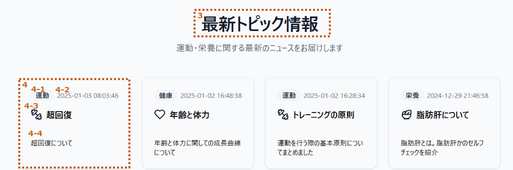

# Home画面設計

## 画面全体図

### PC

### モバイル

[画面全体図_SP](./img/home_sp.png)

## 要件定義

### (1)heroセッション

|no|項目名|種類|定義|備考|
|:----|:----|:----|:----|:----|
|1|AI支援ツール|リンク|/ai_suport/||
|2|問い合わせ|リンク|/our/contact/||

### (2)最新トピック情報

|no|項目名|種類|定義|備考|
|:----|:----|:----|:----|:----|
|3|最新トピック|リンク|/health_info/topic/||
|4|トピックカード|リンク|/health_info/topic/{topic_no}/||

#### 詳細

|no|項目名|型|変数名|例|備考|
|:----|:----|:----|:----|:----|:----|
|4-1|タグ|String|tag|運動|[タグ設定](/app/_components/parts/helth_info_tag.ts)|
|4-2|更新日|String|year + '年' + month + '月' + day + '日'|2025/09/01||
|4-3|タイトル|String|title|記事のタイトル||
|4-4|概要|String|overciew|記事の概要説明||
|||||||

### (3)最新データ情報

|no|項目名|種類|定義|備考|
|:----|:----|:----|:----|:----|
|5|最新データ|リンク|/health_info/healthcare_data/||
|6|データカード|リンク|/health_info/healthcare_data/{data_no}/||

#### 詳細

|no|項目名|型|変数名|例|備考|
|:----|:----|:----|:----|:----|:----|
|6-1|タグ|String|tag|運動|[タグ設定](/app/_components/parts/helth_info_tag.ts)|
|6-2|更新日|String|year + '年' + month + '月' + day + '日'|2025/09/01||
|6-3|タイトル|String|title|データのタイトル||
|6-4|概要|String|overciew|データの概要説明||
|||||||

### (4)サービス

|no|項目名|種類|定義|備考|
|:----|:----|:----|:----|:----|
|7|健康情報一覧|リンク|/health_info/||
|8|トレーニング情報|リンク|/execsise/||
|9|AI支援ツール|リンク|/ai_suport/||

### (5)私たちのミッション

|no|項目名|種類|定義|備考|
|:----|:----|:----|:----|:----|
|10|ミッション詳細|リンク|/our/||