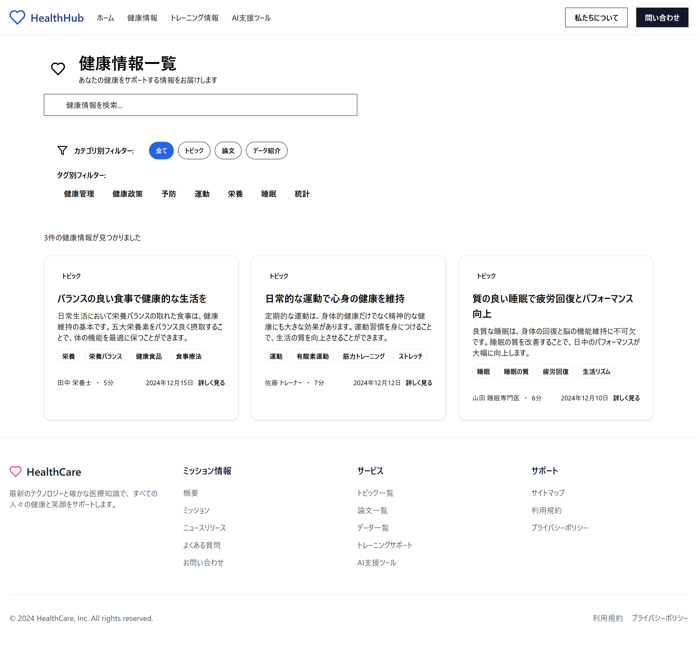
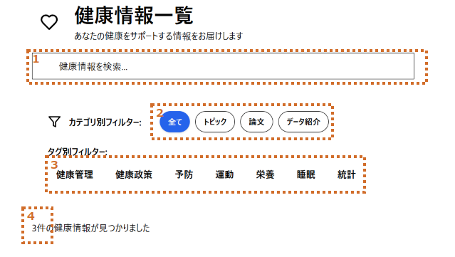
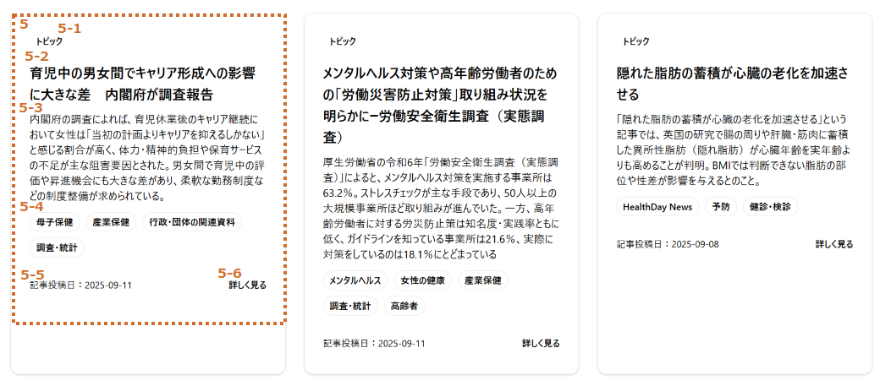

# 健康情報一覧画面設計

## 画面全体図

### PC

### モバイル
[健康情報一覧_sp](./img02/healthinfo_sp.png)

## 要件定義

### (1)検索

|no|項目名|種類|定義|備考|
|:----|:----|:----|:----|:----|
|1|文字検索|input|文字からタイトル・概要・タグで一致する記事を表示||
|2|カテゴリ検索|ボタン|各カテゴリ毎に記事を表示||
|3|タグ検索|ボタン|各タグ毎に記事を表示|複数選択可|
||||||

#### 詳細

|no|項目名|型|変数名|例|備考|
|:----|:----|:----|:----|:----|:----|
|4|表示数|int|filteredInfos.length|2件||
|||||||

### (2)記事一覧

|no|項目名|種類|定義|備考|
|:----|:----|:----|:----|:----|
|5|記事カード|カード|記事のタイトル・概要・サムネイル・投稿日を表示||
||||||

#### 詳細

|no|項目名|型|変数名|例|備考|
|:----|:----|:----|:----|:----|:----|
|5-1|カテゴリ|string|category|||
|5-2|タイトル|string|title|||
|5-3|概要|string|description|||
|5-4|タグ|string|tags|||
|5-5|記事投稿日|string||||
|5-6|詳しくみる|link|url||記事元のサイトに遷移|
|||||||