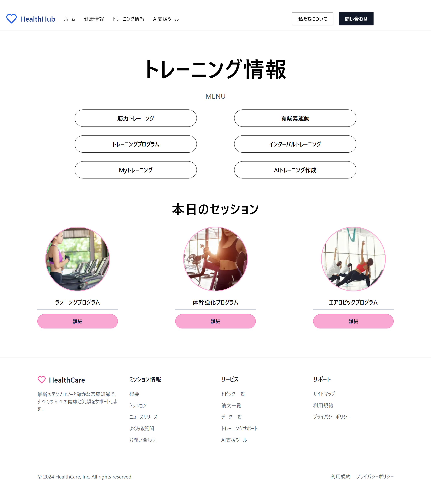
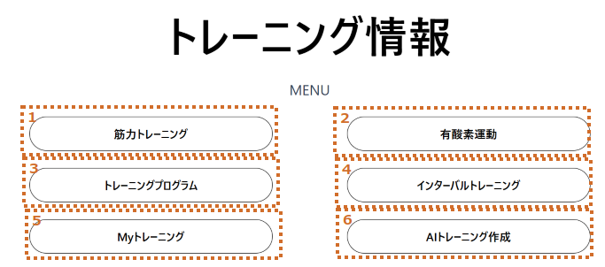
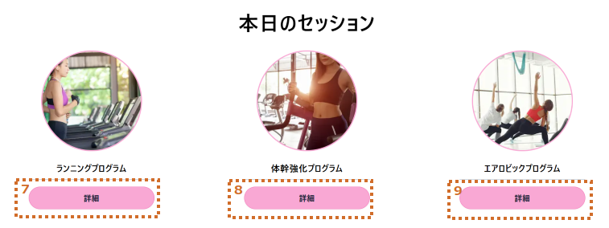

# トレーニング情報画面設計

## 画面全体図

### PC

### sp
[トレーニング情報画面_sp](./img03/execise_sp.png)

## 要件定義

### (1)メニュー

|no|項目名|種類|定義|備考|
|:----|:----|:----|:----|:----|
|1|筋力トレーニング|リンク|./muscle_tr||
|2|有酸素運動|リンク|./earobic_tr||
|3|トレーニングプログラム|リンク|./tr_program||
|4|インターバルトレーニング|リンク|./interval_tr||
|5|Myトレーニング|リンク|./my_tr||
|6|AIトレーニング作成|リンク|./ai_tr||
||||||

### (2)本日のセッション

|no|項目名|種類|定義|備考|
|:----|:----|:----|:----|:----|
|7|ランニングプログラム|リンク|./running_pr||
|8|体幹強化プログラム|リンク|./core_streng_pr||
|9|エアロビックプログラム|リンク|./earbic_pr||
||||||