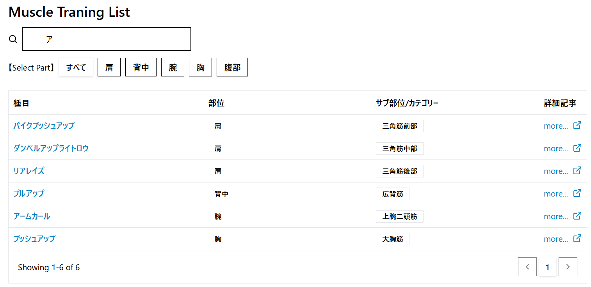

# 筋力トレーニング画面設計

## 画面全体図

### PC/SP

## 要件定義

### (1)トレーニング一覧

|no|項目名|種類|定義|備考|
|:----|:----|:----|:----|:----|
|1|筋力トレーニングリスト|リスト|||
||||||

#### 詳細

|no|項目名|型|変数名|例|備考|
|:----|:----|:----|:----|:----|:----|
|1-1|種目検索|string||||
|1-2|カテゴリ検索|bottan||||
|1-3|種目|string||||
|1-4|部位|string||||
|1-5|部位タグ|string||||
|1-6|種目関連記事|string|||別タブで表示|
|1-7|ページング|bottan||||
|||||||

### (2)トレーニング詳細

|no|項目名|種類|定義|備考|
|:----|:----|:----|:----|:----|
|2|筋力トレーニング詳細|モーダル|||
||||||

#### 詳細

|no|項目名|型|変数名|例|備考|
|:----|:----|:----|:----|:----|:----|
|2-1|種目名|string||||
|2-2|部位タグ|string||||
|2-3|トレーニング動画|string||||
|2-4|アプローチする筋|list||||
|2-5|トレーニング法|list||||
|||||||

