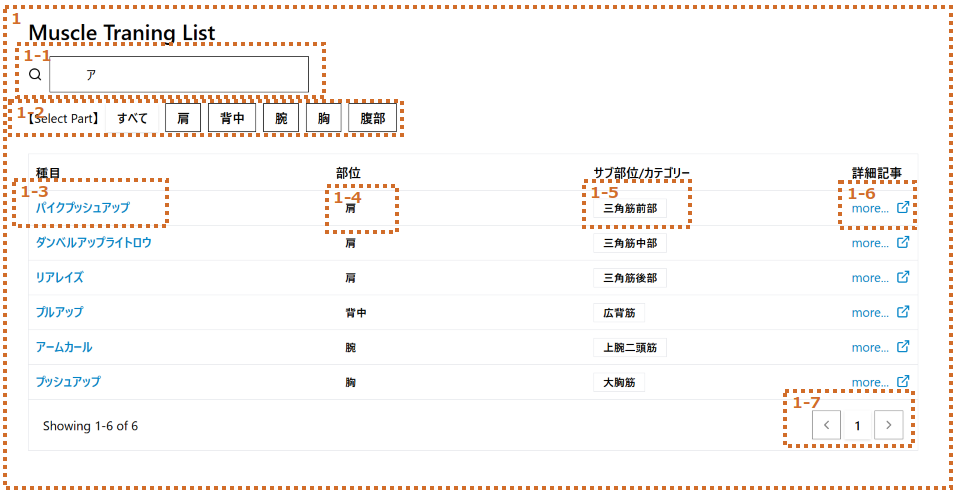

# 有酸素運動画面

## 画面全体図

### PC/SP

### (1)有酸素運動一覧

|no|項目名|種類|定義|備考|
|:----|:----|:----|:----|:----|
|1|有酸素運動リスト|カードリスト|||
||||||

#### 詳細

|no|項目名|型|変数名|例|備考|
|:----|:----|:----|:----|:----|:----|
|||||||

※１：カテゴリリスト
|no|eventKey|eventLabel|
|:----|:----|:----|
|1|all|すべて|
|2|walking|ウォーキング|
|3|running|ランニング|
|4|circit|サーキット|
|5|dance|ダンス|
|6|yoga|ヨガ|
|7|stretch|ストレッチ|
|8|other|分類なし|
||||